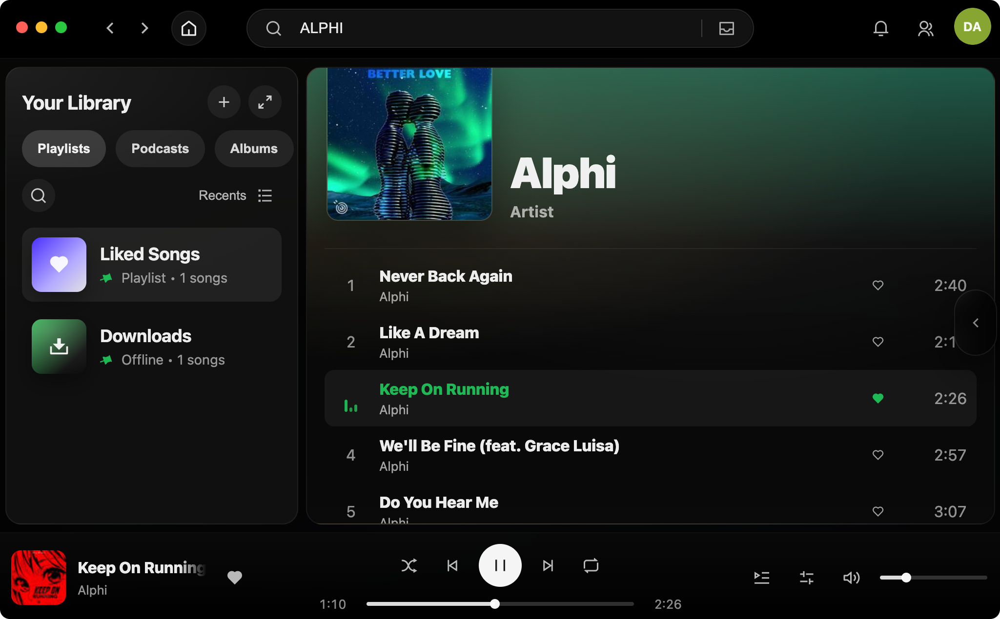

# Project docs

## Screenshot

## What this is

This project is a Spotify-style desktop music client built with Electron.

The goal is to keep the feel and core UX of the Spotify app, but use Deezer as the backend and Deemix-style downloading so playback is ad-free and tracks can be saved locally.

Not affiliated with Spotify or Deezer.

## How it works (high level)

- UI: Vanilla HTML/CSS/JS that recreates the Spotify desktop layout.
- Data: Deezer SDK and Deezer web app state power the Home sections, search, and entity pages.
- Login: A Deezer login popup captures the `arl` cookie, which is used to authenticate API calls.
- Playback: When you press play, the app tries to resolve a local downloaded file first. If it is not present, it downloads the track and then plays it from disk.

## Repo layout

- `main.js`: Electron main process entrypoint. Owns session state, Deezer clients, and IPC handlers.
- `preload.js`: Exposes a small API to the renderer via `contextBridge` (`window.auth`, `window.dz`, `window.dl`, `window.deezer`, `window.app`).
- `renderer/`: UI logic (account menu, navigation, search, player, downloads UI).
- `main/ipc/`: IPC handlers for auth, Deezer, downloads, and app utilities.
- `vendor/`: A small wrapper build (`deemix-lite-entry.ts`) that exposes Deemix-lite download helpers to the main process.
- `deemix-main/`: Vendored Deemix code (including `deezer-sdk`).
- `tests/`: Scratch scripts used during development (not a formal test suite).

## Renderer API (Electron only)

`preload.js` exposes these APIs to the renderer:

- `window.auth`: login/logout + session status (`main/ipc/auth.js`)
- `window.deezer`: Deezer app state helpers (`main/ipc/deezer.js`)
- `window.dz`: Deezer SDK wrapper (search, pages, tracklists, likes) (`main/ipc/dz.js`)
- `window.dl`: downloads, local library scanning, download events (`main/ipc/downloads.js`)
- `window.app`: small app utilities (open session dir, clear app state) (`main/ipc/app.js`)

## Login and session

1. Click the avatar menu (top right) and choose "Log in".
2. Electron opens a popup to Deezer login (default `https://account.deezer.com/en/login/`).
3. After login, the app captures the `arl` cookie and the current cookie jar.
4. The session is persisted on disk:
   - `.session/arl.enc.json`: the `arl` value, encrypted (Electron `safeStorage` when available, otherwise AES-GCM with a key stored under Electron userData).
   - `.session/cookies.json`: the cookie jar (mode `0600`).

In dev, `.session/` is created in the repo. When packaged, session files live under Electron userData. You can override this with `SESSION_DIR`.

Optional: a local-only HTTP server is started on `127.0.0.1` to help with debugging and tooling:

- `GET /health`
- `GET /session` (can require a token, and can optionally expose `arl` and cookies)
- `GET /app-state` (reads `.session/app_state.json` when present)

## Deezer app state extraction (Home sections)

After login, the main process tries to extract Deezer's web app state (`window.__DZR_APP_STATE__`) using a hidden BrowserWindow with your session cookies (or `arl`).

That state is stored at `.session/app_state.json` and the renderer reads it via `window.deezer.getAppState()` to populate the Home sections.

## Downloads and playback

- Downloads are handled in the main process (`main/ipc/downloads.js`) using:
  - `deezer-sdk` for metadata and access
  - a vendored Deemix-lite wrapper for generating download objects and running the downloader
- Downloads live under `.session/downloads/` in dev (or under Electron userData when packaged).
- The player (`renderer/player.js`) prefers an existing local file:
  - checks embedded download metadata
  - checks the downloads DB
  - checks the local library cache
  - otherwise triggers a download and then plays the resulting `file://` URL

Download quality is controlled by the Settings UI and stored in localStorage:

- `mp3_128`
- `mp3_320` (requires a Deezer account that can stream HQ)
- `flac` (requires a Deezer account that can stream lossless)

## Where things stand

Implemented:

- Spotify-like layout (sidebar, Home, Search, entity pages, player bar)
- Deezer login popup and persisted session (`arl` + cookies)
- Basic Deezer browsing:
  - Home sections from extracted app state
  - Search (tracks, albums, artists, playlists)
  - Entity pages with track lists (albums, playlists, artists)
- Local playback via downloaded files
- Download queue events and UI badges (downloads in progress, completed)
- Local library state stored in localStorage (Liked Songs, Recents, basic saved albums/playlists metadata)

In progress / rough edges:

- Some views and Spotify features are placeholders (friend activity, full library parity, etc).
- The downloads flow is optimized for "download then play" rather than true streaming.

## Useful env vars

- `AUTO_OPEN_DEVTOOLS=false`: do not auto-open DevTools.
- `MUSIC_APP_LOGIN_URL`: override the login popup URL.
- `SESSION_DIR`: override where `.session/` is stored in dev.
- `SESSION_WEBHOOK_PORT`: port for the local webhook server (default `3210`).
- `SESSION_WEBHOOK_TOKEN`: require `x-webhook-token` for webhook requests.
- `SESSION_WEBHOOK_EXPOSE_ARL=true`: include `arl` in `GET /session`.
- `SESSION_WEBHOOK_EXPOSE_COOKIES=true`: include cookies in `GET /session`.
- `CHROME_EXTENSIONS`, `KEEPASS_EXTENSION_DIR`, `KEEPASSXC_EXTENSION_DIR`: load Chrome extensions (comma-separated paths), useful for password managers.
